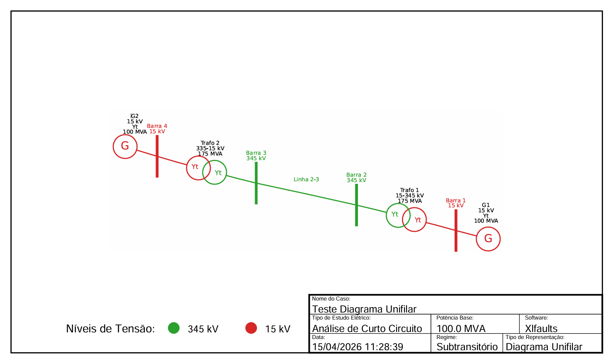
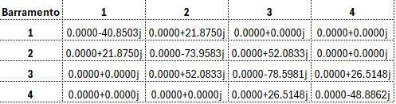
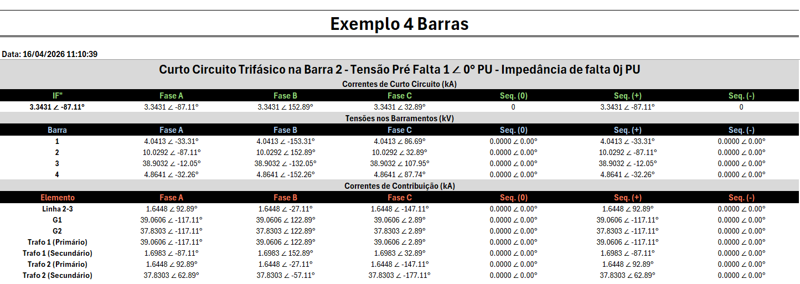

# ⚡ XLFaults – Simulador de Curto-Circuito no Excel

O **Xlfaults** é uma ferramenta para análises de curto-circuito em sistemas elétricos de potência. Seus principais diferenciais são ser uma ferramenta gratuita, sem limitação de barramentos e com interface inteiramente baseada no Microsoft Excel, tornando-a extremamente acessível.

A proposta do projeto é tornar a modelagem e análise de sistemas elétricos mais simples, eliminando a necessidade de entrada de dados via arquivos de texto (txt) ou o desenho manual de diagramas, já que o software possui uma função de desenho automático e organizado.

---

## 📌 Objetivo do Projeto

O XLFaults foi desenvolvido para:

- **Facilitar** a análise de curto-circuito.
- **Melhorar** a organização de dados elétricos.
- **Utilizar** ferramentas acessíveis (Excel e Python).
- **Disponibilizar** uma solução gratuita principalmente para estudantes de engenharia elétrica.

---

## 🚀 Principais Diferenciais

- 📊 **Interface Gráfica:** 100% baseada no Excel.
- 🔌 **Poder do Python:** Integração com Python para cálculos matriciais complexos.
- ⚡ **Simulações Diversas:** Suporte a diferentes tipos de faltas (Trifásica, Monofásica, etc).
- 📈 **Diagramas Automáticos:** Geração automática de diagramas unifilares.
- 📑 **Relatórios Profissionais:** Resultados organizados e formatados prontos para uso.
- 🔍 **Compatibilidade:** Leitura de arquivos do software Anafas.

---

## 🛠️ Instalação

1. **Baixe** o projeto no GitHub.
2. **Abra** um arquivo Excel habilitado para macros (`.xlsm`).
3. **Salve** o arquivo Excel na pasta do projeto.
4. **Ative** a guia **Desenvolvedor** no Excel. [Veja o tutorial em vídeo](https://youtu.be/7Vf9jql_pl4?si=vzjQpKDQScCn7GsI)
5. Vá em **Desenvolvedor** > **Suplementos do Excel** > **Procurar** > Selecione o arquivo `suplemento_xlfaults.xlam` (localizado em `Xlfaults > Addin`) > **Ok**.
6. Na aba **'Curto Circuito'**, clique no botão **'Instalar Bibliotecas'** Isso instalará automaticamente os pacotes listados no arquivo `requirements.txt

---

## ⚙️ Configuração Inicial

Antes de iniciar as simulações:

- Clique no botão "**Gerar Layout**" através do menu.
- Salve o Arquivo resultante na pasta do projeto, habilitado para macros (xlsm)
- Defina a **Potência Base** (ex: 100 MVA).
- Nomeie o seu caso de estudo.
- Escolha a unidade dos resultados: **P.U. (por unidade)** ou **Valores Reais (kA, kV)**.

---

## 🧩 Modelagem do Sistema

A modelagem é feita de forma intuitiva preenchendo as tabelas. 
**OBS 1 : Não modificar as colunas em laranja!**
**OBS 2 : Os nomes funcionam como identificador único - Não repetir eles!**

### 🔹 Barramentos

- Identificação Número e Nome da barra.
- Níveis de Tensão (usada como a tensão base da região).

### 🔹 Linhas de Transmissão

-  Impedâncias de Sequências ($Z_1, Z_0$).
- Tensão base da Linha
- Potência Base.

### 🔹 Transformadores

- Relações de Transformação Base do Transformador.
- Potência Base.
- Configurações de Conexão (Delta - D, Estrela Aterrado - Yt, Estrela - Y) 
- Defasagens Entre Primário e Secundário.
- Impedâncias ($Z_1, Z_0, Z_n$).

### 🔹 Máquinas

- Tipo de Máquina (Gerador ou Motor) - É relevante apenas no diagrama unifilar
- Tensão base da Máquina.
- Tipo de máquina e conexões.
- Impedâncias ($Z_1, Z_0, Z_n$).

---

## ⚡ Tipos de Curto-Circuito

O simulador permite configurar detalhadamente:

- **Trifásico**
- **Monofásico**
- **Bifásico**
- **Bifásico-Terra**

**Recursos adicionais:**
- Inclusão de impedância de falta.
- Consideração de tensão de pré-falta.
- Seleção das barras de aplicação do curto.
- Execução de múltiplos curtos em cadeia.

---

## 📊 Resultados

Após a simulação, o XLFaults gera automaticamente:

### 📌 Diagrama Unifilar
- Coloração automática por nível de tensão.
- Legenda técnica. 
- Exportação direta para PDF.

### 📌 Matrizes do Sistema
- Visualização da **Matriz de Admitância** ($Y_{barra}$).
- Visualização da **Matriz de Impedância** ($Z_{barra}$).
- Forma cartesiana.
- Resultados com 4 casas decimais (ajustável no código fonte).

### 📌 Relatório Completo

- Correntes de curto-circuito.
- Tensões em todos os barramentos durante a falta.
- Contribuição de corrente de cada elemento conectado.
- Resultados com 4 casas decimais (ajustável no código fonte).

---

## ✅ Validação

Os resultados do XLFaults foram validados através de:

1. **Software Anafas:** Comparação com resultados do software profissional.
2. **Exemplos Acadêmicos:** Validação com notas de aula do Prof. André Alves [1].
3. **Software AFASEP** Comparação com resultados do software. [Disponível em](https://www.linkedin.com/posts/gabriel-bie-da-fonseca-a726201b3_ol%C3%A1-rede-no-dia-03112025-realizei-a-activity-7399766044426362880-XvdW?utm_source=share&utm_medium=member_desktop&rcm=ACoAACt7PvcBriVKGiD0y27xIpS4vg14ubX1p-k)
4. **Precisão:** Resultados com 4 casas decimais (ajustável no código fonte).

---

## 🔮 Próximas Funcionalidades

- 🔁 Suporte a transformadores de **três enrolamentos**.
- 🎚️ Ajuste de **TAP** em transformadores.
- ✂️ Redução de Kron.
- 🏝️ Tratamento para barras isoladas e ilhas.
- 📊 Módulo integrado de **Fluxo de Potência**.

---

## 🎥 Demonstração e Tutoriais

Confira o funcionamento da ferramenta no vídeo abaixo:

👉 **[Assista ao Tutorial no YouTube](https://youtu.be/DFxH0akx1NI)**

---

## 📚 Bibliotecas Utilizadas

- **Pandas:** Tratamento de tabelas de dados.
- **Numpy:** Operações matriciais de alta performance.
- **xlwings:** Integração e formatação em tempo real no Excel.
- **PyMuPDF:** Geração e manipulação de relatórios em PDF.
- **NetworkX:** Gestão de grafos para a topologia do sistema.
- **SchemDraw:** Motor de desenho dos diagramas elétricos.
- **Seaborn:** Gestão de paletas de cores técnicas.

---

## 📖 Referências

- [01] - Prof. André G. P. Alves - Material Didático de ASP I. [Disponível em:](https://docs.google.com/forms/d/e/1FAIpQLSdyKfH6FUB-DrT-k-JA5cxSdpKW-zhmEf03mbyJ-LJWqETsDg/viewform?usp=sf_link)
- [02] AHMED, S. et al. *Fault current limiters and THD in IEEE 9 bus system*. In: **ICET**, 2017.
- [03] CEPEL – CENTRO DE PESQUISAS DE ENERGIA ELÉTRICA. *ANAFAS*. 2023. Software.
- [04] PYTHON SOFTWARE FOUNDATION. *Python programming language*. Version 3.8, 2025.
- [05] NETWORKX. Disponível em: [https://networkx.org](https://networkx.org).
- [06] NUMPY. Disponível em: [https://numpy.org](https://numpy.org).
- [07] MICROSOFT. *Microsoft Excel (Office 365)* [software]. Disponível em: [https://www.microsoft.com/excel](https://www.microsoft.com/excel).

---

## 👨‍💻 Autor e Desenvolvedor

**Daniel Murad de Freitas** - Estudante de Engenharia Elétrica na UERJ  
- Interesse em estudos elétricos aplicados a Sistemas Elétricos de Potência  
- Conhecimento em Python para automação e análise de dados  
- Áreas de interesse: curto-circuito, fluxo de potência, proteção de sistemas elétricos, inteligência artificial e machine learning.