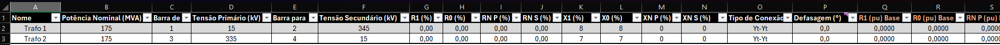

# ⚡ XLFaults – Simulador de Curto Circuito no Excel

O **Xlfaults** é uma ferramenta para análises de curto-circuito em sistemas elétricos de potência. Seus principais diferenciais são ser uma ferramenta gratuita, sem limitação de barramentos e com interface inteiramente baseada no Microsoft Excel, tornando-a extremamente acessível.

A proposta do projeto é tornar a modelagem e análise de sistemas elétricos mais simples, eliminando a necessidade de entrada de dados via arquivos de texto (txt) ou o desenho manual de diagramas, já que o software possui uma função de desenho automático e organizado.

---

## 📌 Objetivo do Projeto

O XLFaults foi desenvolvido para:

- **Facilitar** a análise de curto-circuito.
- **Melhorar** a organização de dados elétricos.
- **Utilizar** ferramentas acessíveis (Excel).
- **Integrar** engenharia elétrica com programação Python.
- **Disponibilizar** uma solução gratuita principalmente para estudantes.

---

## 🚀 Principais Diferenciais

- 📊 **Interface Familiar:** 100% baseada em tabelas no Excel.
- 🔌 **Poder do Python:** Integração com Python para cálculos matriciais complexos.
- ⚡ **Simulações Diversas:** Suporte a diferentes tipos de faltas (Trifásica, Monofásica, etc).
- 📈 **Diagramas Automáticos:** Geração automática de diagramas unifilares.
- 📑 **Relatórios Profissionais:** Resultados organizados e formatados prontos para uso.
- 🔍 **Compatibilidade:** Leitura de arquivos do software Anafas.

---

## 🛠️ Instalação

1. **Baixe** o projeto no GitHub.
2. **Abra** um arquivo Excel habilitado para macros (`.xlsm`).
3. **Salve** o arquivo Excel na pasta do projeto.
4. **Ative** a guia **Desenvolvedor** no seu Excel.
5. Vá em **Desenvolvedor** > **Suplementos do Excel** > **Procurar** > Selecione o arquivo `suplemento_xlfaults.xlam` (localizado em `Xlfaults > Addin`) > **Ok**.
6. Na aba **'Curto Circuito'**, clique no botão **'Instalar Bibliotecas'** Isso instalará automaticamente os pacotes listados no arquivo `requirements.txt

---

## ⚙️ Configuração Inicial

Antes de iniciar as simulações:

- Gere o **Layout padrão** através do menu.
- Salve o Arquivo resultante na pasta do projeto, habilitado para macros (xlsm)
- Defina a **Potência Base** (ex: 100 MVA).
- Nomeie o seu caso de estudo.
- Escolha a unidade dos resultados: **P.U. (por unidade)** ou **Valores Reais (kA, kV)**.

---

## 🧩 Modelagem do Sistema

A modelagem é feita de forma intuitiva preenchendo as tabelas:

### 🔹 Barramentos

- Identificação (Número e Nome).
- Níveis de Tensão.
- Tipo de sistema.

### 🔹 Linhas de Transmissão

- Impedâncias de sequência positiva e zero ($Z_1, Z_0$).

### 🔹 Transformadores

- Relações de transformação e Potência Base.
- Configurações de conexão e defasagens.
- Impedâncias ($Z_1, Z_0, Z_n$).

### 🔹 Máquinas

- Tipo de máquina e conexões.
- Impedâncias ($Z_1, Z_0, Z_n$).

---

## ⚡ Tipos de Curto-Circuito

O simulador permite configurar detalhadamente:

- **Trifásico**
- **Monofásico**
- **Bifásico**
- **Bifásico-Terra**

**Recursos adicionais:**
- Inclusão de impedância de falta.
- Consideração de tensão de pré-falta.
- Seleção das barras de aplicação do curto.
- Execução de múltiplos curtos simultâneos.

---

## 📊 Resultados

Após a simulação, o XLFaults gera automaticamente:

### 📌 Diagrama Unifilar
- Coloração automática por nível de tensão.
- Legenda técnica e exportação direta para PDF.

### 📌 Matrizes do Sistema
- Visualização da **Matriz de Admitância** ($Y_{barra}$).
- Visualização da **Matriz de Impedância** ($Z_{barra}$).
- Forma cartesiana.

### 📌 Relatório Completo

- Correntes de curto-circuito.
- Tensões em todos os barramentos durante a falta.
- Contribuição de corrente de cada elemento conectado.

---

## ✅ Validação

Os resultados do XLFaults foram rigorosamente validados através de:

1. **Software Anafas:** Comparação com resultados de software profissional.
2. **Exemplos Acadêmicos:** Validação com notas de aula do Prof. André Alves [1].
3. **Precisão:** Resultados com 4 casas decimais (ajustável no código fonte).

---

## 🔮 Próximas Funcionalidades

- 🔁 Suporte a transformadores de **três enrolamentos**.
- 🎚️ Ajuste de **TAP** em transformadores.
- ✂️ Redução de Kron.
- 📊 Módulo integrado de **Fluxo de Potência**.

---

## 🎥 Demonstração e Tutoriais

Confira o funcionamento da ferramenta no vídeo abaixo:

👉 **[Assista ao Tutorial no YouTube](https://youtu.be/DFxH0akx1NI)**

---

## 📚 Bibliotecas Utilizadas

- **Pandas:** Tratamento de tabelas de dados.
- **Numpy:** Operações matriciais de alta performance.
- **xlwings:** Integração e formatação em tempo real no Excel.
- **PyMuPDF:** Geração e manipulação de relatórios em PDF.
- **NetworkX:** Gestão de grafos para a topologia do sistema.
- **SchemDraw:** Motor de desenho dos diagramas elétricos.
- **Seaborn:** Gestão de paletas de cores técnicas.

---

## 📖 Referências

- [01] - Alves, André. Notas de aula de Sistemas de Potência.

---

## 👨‍💻 Autor e Desenvolvedor

**Daniel Murad de Freitas** - Estudante de Engenharia Elétrica – UERJ  
- Foco em Sistemas Elétricos de Potência  
- Afinidade em Python para Automação e Dados  
- Interesses: Curto-circuito, Proteção e Machine Learning.